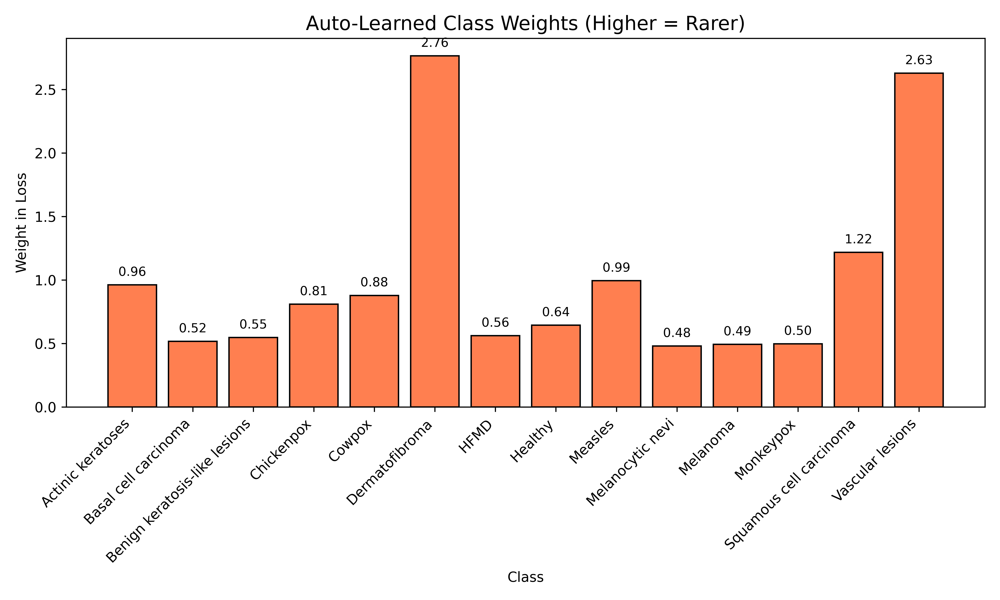
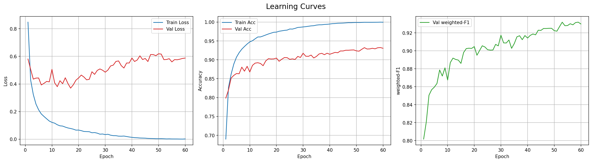
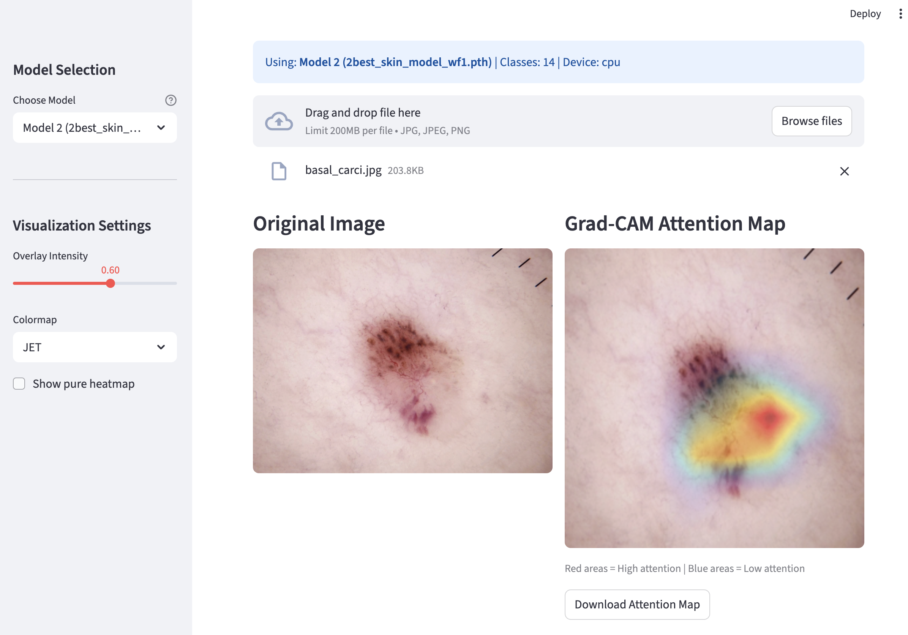

# Skin Lesion Classification with MobileViTv2 and Dual-Weighted Learning

A lightweight deep learning pipeline for 14-class skin lesion classification addressing severe class imbalance through dual-weighted learning strategies.

## Overview

This implementation trains a compact MobileViTv2 model (~4M parameters) on a merged HAM10000+MSLDv2.0 dataset covering dermatoscopic cancers and infectious skin diseases. The approach combines inverse square-root weighted sampling with Effective Number of Samples (ENS) loss reweighting to handle extreme class imbalance (up to 53.9:1 ratio).

**Key Results**:
- Weighted F1-score: 0.9263
- Weighted AUC: 0.9803
- Test Accuracy: 92.76%
- Macro F1-score: 0.9185

## Dataset

**14-Class Merged Dataset**: HAM10000 + MSLDv2.0

The combined dataset includes: Actinic keratoses, Basal cell carcinoma, Benign keratosis-like lesions, Chickenpox, Cowpox, Dermatofibroma, Healthy, HFMD, Measles, Melanocytic nevi, Melanoma, Monkeypox, Squamous cell carcinoma, and Vascular lesions.

### Class Distribution

| Class | Count | Percent |
|-------|-------|---------|
| Melanocytic nevi | 10,300 | 35.1% |
| Melanoma | 3,617 | 12.3% |
| Monkeypox | 3,408 | 11.6% |
| Basal cell carcinoma | 2,658 | 9.1% |
| Benign keratosis-like lesions | 2,099 | 7.2% |
| HFMD | 1,932 | 6.6% |
| Healthy | 1,368 | 4.7% |
| Chickenpox | 900 | 3.1% |
| Cowpox | 792 | 2.7% |
| Actinic keratoses | 693 | 2.4% |
| Measles | 660 | 2.3% |
| Squamous cell carcinoma | 502 | 1.7% |
| Vascular lesions | 202 | 0.7% |
| Dermatofibroma | 191 | 0.7% |

**Total Training Samples**: 29,322  
**Imbalance Ratio**: 53.9:1 (most common vs rarest class)

### ENS Loss Weights



The Effective Number of Samples automatically computes loss weights inversely proportional to class frequency, assigning highest penalties to rare classes (Dermatofibroma: 2.76, Vascular lesions: 2.63) and lowest to majority classes (Melanocytic nevi: 0.48, Monkeypox: 0.50).

## Method

### Architecture

**Backbone**: MobileViTv2-100
- Hybrid CNN-Transformer architecture
- ~4M parameters (mobile-deployable)
- MobileNet-style convolutions for local features
- Lightweight transformers for global context
- Input resolution: 256×256
- Pretrained on ImageNet-1K

### Dual-Weighted Learning Strategy

The approach addresses class imbalance at two complementary stages:

**1. Inverse Square-Root Weighted Sampling**

Increases mini-batch exposure for rare classes by reweighting sampling probabilities:

```
P(class_i) ∝ (count_i)^α / Σ(count_j)^α
```

where `α = 0.5` (square-root sampling)

- Epoch size multiplier: 1.5× base dataset
- Balances between uniform and frequency-based sampling
- Prevents extreme oversampling of minority classes

**2. Effective Number of Samples (ENS) Loss Weighting**

Reduces gradient dominance from majority classes through class-balanced cross-entropy:

```
effective_num = 1.0 - β^n
weight = (1 - β) / effective_num
```

where `β = 0.999` and `n` is the number of samples per class

- Assigns higher loss penalties to rare classes
- Maintains stable numerical range (0.48–2.76×)
- Prevents gradient explosion unlike naive inverse-frequency weighting

### Training Configuration

| Hyperparameter | Value |
|----------------|-------|
| Optimizer | AdamW |
| Learning Rate | 3e-4 |
| Weight Decay | 0.05 |
| LR Scheduler | CosineAnnealingLR |
| Batch Size | 32 |
| Epochs | 60 |
| Mixed Precision | Automatic (CUDA/MPS/CPU) |
| Early Stopping | Validation weighted F1 |

### Data Augmentation

**Training Pipeline**:
- RandomResizedCrop(256, scale=(0.7, 1.0), ratio=(0.9, 1.1))
- RandomHorizontalFlip(p=0.5)
- RandomVerticalFlip(p=0.2)
- ColorJitter(brightness=0.1, contrast=0.1, saturation=0.1, hue=0.05)
- RandomRotation(±15°)
- Normalize(mean=[0.485, 0.456, 0.406], std=[0.229, 0.224, 0.225])

**Validation/Test Pipeline**:
- Resize(int(256 × 1.14)) = 292
- CenterCrop(256)
- Normalize(ImageNet statistics)

## Results

### Overall Performance

| Metric | Score |
|--------|-------|
| Weighted F1-score | 0.9263 |
| Test Accuracy | 0.9276 |
| Macro F1-score | 0.9185 |
| Weighted AUC | 0.9803 |
| Test Loss | 0.6552 |

### Learning Curves



Training demonstrates stable convergence with validation weighted F1 peaking above 0.92 and minimal train-validation gap, indicating good generalization.

### Confusion Matrices

**Test Set Performance**:


**Validation Set Performance**:


**Training Set Performance**:


### Per-Class Performance

| Class | Precision | Recall | F1-score | Support |
|-------|-----------|--------|----------|---------|
| Actinic keratoses | 0.7889 | 0.8068 | 0.7978 | 88 |
| Basal cell carcinoma | 0.9012 | 0.9309 | 0.9158 | 333 |
| Benign keratosis-like lesions | 0.8858 | 0.7376 | 0.8050 | 263 |
| Chickenpox | 0.9912 | 0.9912 | 0.9912 | 113 |
| Cowpox | 0.9900 | 1.0000 | 0.9950 | 99 |
| Dermatofibroma | 1.0000 | 0.6800 | 0.8095 | 25 |
| HFMD | 1.0000 | 0.9959 | 0.9979 | 242 |
| Healthy | 1.0000 | 0.9942 | 0.9971 | 171 |
| Measles | 1.0000 | 1.0000 | 1.0000 | 83 |
| Melanocytic nevi | 0.9146 | 0.9651 | 0.9392 | 1288 |
| Melanoma | 0.8629 | 0.8057 | 0.8333 | 453 |
| Monkeypox | 0.9953 | 0.9977 | 0.9965 | 426 |
| Squamous cell carcinoma | 0.8710 | 0.8438 | 0.8571 | 64 |
| Vascular lesions | 0.9231 | 0.9231 | 0.9231 | 26 |

### Key Observations

**Strong Performance on Rare Classes**:
- Vascular lesions (n=26): F1=0.9231
- Dermatofibroma (n=25): F1=0.8095
- Infectious diseases (Chickenpox, Measles, Monkeypox): F1 > 0.99

**Primary Confusion Patterns**:
- Melanoma ↔ Melanocytic nevi (64 errors, clinically expected)
- Benign keratosis ↔ Melanocytic nevi (28 errors)
- High precision maintained on dangerous conditions (Melanoma, BCC, SCC)

**Near-Perfect Classification**:
- Viral infections: Chickenpox, Cowpox, Measles, Monkeypox
- Healthy skin: 99.4% recall
- HFMD: 99.6% recall

### Model Interpretability: Grad-CAM Analysis



Gradient-weighted Class Activation Mapping (Grad-CAM) reveals the spatial regions that most strongly influence the model's predictions. The visualization demonstrates that the model focuses attention on clinically relevant features:

**Attention Pattern Analysis**:
- Red regions indicate high attention (strong discriminative features)
- Blue regions indicate low attention (background/non-diagnostic areas)
- The model correctly localizes lesion boundaries and textural patterns
- Central lesion features receive strongest activation weights

For the basal cell carcinoma example shown above, the model concentrates attention on the lesion's irregular pigmentation and peripheral structures, consistent with dermatological diagnostic criteria. This spatial localization provides clinical interpretability and builds trust in model predictions by showing that decisions are based on medically relevant image regions rather than spurious correlations.

## Installation

### Requirements

- Python 3.13+
- PyTorch 2.9.1+
- torchvision 0.24.1+
- timm 1.0.22+
- scikit-learn 1.8.0+
- rich 14.2.0+
- matplotlib 3.10.8+
- seaborn 0.13.2+
- pydantic-settings 2.12.0+

### Setup

```bash
# Clone repository
git clone <repository-url>
cd skin-lesion-classifier

# Install dependencies
pip install -e .

# Download dataset
kaggle datasets download -d ahmedxc4/skin-ds
unzip skin-ds.zip -d data/

# Verify structure
data/
├── train/
├── val/
└── test/
```

### Project Structure

```
skin-lesion-classifier/
├── src/
│   ├── __init__.py
│   ├── config.py          # Centralized configuration
│   ├── dataset.py         # Data loading + ENS weights
│   ├── engine.py          # Training/evaluation loops
│   ├── modeling.py        # Model architecture
│   └── utils.py           # Visualization utilities
├── data/
│   ├── train/             # Training images by class
│   ├── val/               # Validation images
│   └── test/              # Test images
├── checkpoints/           # Saved model weights
├── results/               # Generated plots and metrics
├── main.py                # Training entry point
├── pyproject.toml         # Dependencies
├── .env                   # Environment variables (optional)
└── README.md
```

## Usage

### Training

```bash
python main.py
```

The training script automatically:
- Detects available device (CUDA/MPS/CPU)
- Loads data with dual-weighted sampling
- Trains with mixed precision (when supported)
- Tracks best model via validation weighted F1
- Saves checkpoints to `checkpoints/best_model.pth`
- Generates learning curves and confusion matrices

**Expected Runtime**: ~45-60 minutes on NVIDIA T4 GPU

### Configuration

All hyperparameters are centralized in `src/config.py`:

```python
# Model
MODEL_ARCH = "mobilevitv2_100"
IMG_SIZE = 256
PRETRAINED = True

# Training
BATCH_SIZE = 32
EPOCHS = 60
LEARNING_RATE = 3e-4
WEIGHT_DECAY = 0.05

# Dual-Weighted Learning
SAMPLER_ALPHA = 0.5      # Square-root sampling
LOSS_BETA = 0.999        # ENS loss weighting
EPOCH_SIZE_MULT = 1.5    # Extended epoch length

# System
NUM_WORKERS = 4
PIN_MEMORY = True
```

Override via environment variables or `.env` file.

### Inference

```python
import torch
from PIL import Image
from torchvision import transforms
from src.modeling import create_model
from src.config import settings

# Load model
model = create_model(num_classes=14)
model.load_state_dict(torch.load('checkpoints/best_model.pth', weights_only=True))
model.to(settings.DEVICE)
model.eval()

# Define transform
transform = transforms.Compose([
    transforms.Resize(292),
    transforms.CenterCrop(256),
    transforms.ToTensor(),
    transforms.Normalize([0.485, 0.456, 0.406], [0.229, 0.224, 0.225])
])

# Load and predict
image = Image.open('path/to/lesion.jpg')
input_tensor = transform(image).unsqueeze(0).to(settings.DEVICE)

with torch.no_grad():
    logits = model(input_tensor)
    probs = torch.softmax(logits, dim=1)
    pred_class = probs.argmax().item()
    confidence = probs.max().item()

print(f"Predicted class: {pred_class}")
print(f"Confidence: {confidence:.4f}")
```

### Device Compatibility

The codebase automatically detects and adapts to available hardware:

```python
# Automatic device detection (config.py)
def _get_device(self) -> str:
    if torch.cuda.is_available():
        return "cuda"
    if torch.backends.mps.is_available():
        return "mps"
    return "cpu"
```

**CUDA**: Full mixed precision with GradScaler  
**MPS** (Apple Silicon): Mixed precision without scaler  
**CPU**: FP32 training fallback

## Technical Details

### Why Dual-Weighted Learning?

Standard cross-entropy training on imbalanced datasets leads to:
- Gradient dominance by majority classes (35% of batches from one class)
- Poor exposure to minority classes in mini-batches
- Systematic underperformance on rare diseases

**Single-strategy limitations**:
- Sampling alone: Majority classes still dominate loss gradients
- Loss weighting alone: Rare classes underrepresented in batches

**Dual-weighted solution**:
1. Sampling ensures frequent mini-batch exposure to rare classes
2. Loss weighting prevents majority gradient dominance during optimization

### Hyperparameter Justification

**SAMPLER_ALPHA = 0.5**
- `α = 0`: uniform sampling (ignores frequency)
- `α = 1`: frequency-based (no rebalancing)
- `α = 0.5`: square-root compromise
- Prevents extreme oversampling while ensuring visibility

**LOSS_BETA = 0.999**
- Higher `β` emphasizes rare classes more strongly
- `β = 0.999` provides strong reweighting without instability
- Maintains weights in stable range (0.48–2.76×)
- Reference: Cui et al. "Class-Balanced Loss Based on ENS" (CVPR 2019)

**EPOCH_SIZE_MULT = 1.5**
- Extends epoch to expose model to more minority samples
- Balances convergence speed vs. rare class learning
- Avoids excessive repeated sampling

### ENS Weight Formula

For class `i` with `n_i` samples:

```
effective_num_i = 1.0 - β^(n_i)
weight_i = (1 - β) / effective_num_i
normalized_weight_i = weight_i / mean(weights)
```

**Example (Dermatofibroma, n=191, β=0.999)**:
```
effective_num = 1.0 - 0.999^191 ≈ 0.174
weight = (1 - 0.999) / 0.174 ≈ 0.00575
normalized_weight ≈ 2.76
```

This prevents the weight explosion of naive inverse-frequency (`1/n`), which would assign ~50× weight to the rarest class.

## Evaluation Metrics

### Primary Metric: Weighted F1-score

```
F1_i = 2 × (precision_i × recall_i) / (precision_i + recall_i)
F1_weighted = Σ(support_i / total) × F1_i
```

Accounts for class imbalance by weighting per-class F1 by support, ensuring both frequent and rare classes contribute appropriately.

### Additional Metrics

**Macro F1**: Unweighted average treating all classes equally  
**Weighted AUC**: Multi-class ROC-AUC with support weighting  
**Confusion Matrix**: Identifies systematic misclassification patterns

## Comparative Analysis

| Method | Dataset | Classes | Params | Key Metric |
|--------|---------|---------|--------|------------|
| This work (MobileViTv2) | HAM10000+MSLDv2.0 | 14 | ~4M | wF1=0.9263 |
| Aruk et al. (2025) | HAM10000 | 7 | 38M | F1=0.9111 |
| Aruk et al. (2025) | ISIC 2019 | 8 | 38M | F1=0.9038 |

Despite 9.5× fewer parameters, the dual-weighted approach achieves competitive performance on a more challenging 14-class task with extreme imbalance.

## References

1. Mehta, S., & Rastegari, M. (2022). Separable self-attention for mobile vision transformers. *arXiv preprint arXiv:2206.02680*.

2. Cui, Y., Jia, M., Lin, T. Y., Song, Y., & Belongie, S. (2019). Class-balanced loss based on effective number of samples. In *CVPR* (pp. 9268-9277).

3. Tschandl, P., Rosendahl, C., & Kittler, H. (2018). The HAM10000 dataset: A large collection of multi-source dermatoscopic images of common pigmented skin lesions. *Scientific Data*, 5(1), 180161.

4. Ali, S. N., et al. (2023). A web-based mpox skin lesion detection system using state-of-the-art deep learning models considering racial diversity. *arXiv preprint arXiv:2306.14169*.

5. Aruk, I., Pacal, I., & Toprak, A. N. (2025). A novel hybrid ConvNeXt-based approach for enhanced skin lesion classification. *Expert Systems with Applications*, 283, 127721.

## License

MIT License

## Citation

If you use this code in your research, please cite:

```bibtex
@article{regmi2025skinlesion,
  title={Skin Lesion Classification with MobileViTv2 and Dual-Weighted Learning},
  author={Regmi, Kshitiz and Xu, Ping},
  journal={Preprint. Under review.},
  year={2025},
  institution={Georgia State University}
}
```

## Contact

Kshitiz Regmi - kregmi3@student.gsu.edu  
Ping Xu - pxu4@gsu.edu  
Department of Computer Science, Georgia State University